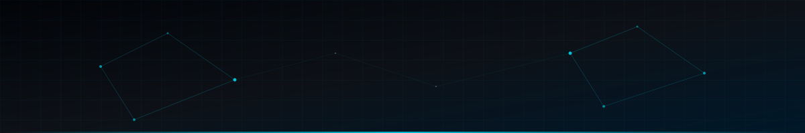

  

 

  
  
  
  

 

## ⸻ Production Systems & Engineering Experience

| 🛡️ GHOST — Autonomous Security Agent |
| :--- |
| Owned end-to-end development of an autonomous security agent supporting 3 local LLM models with adaptive stealth. Achieved fully air-gapped operation, completely eliminating all external API dependencies for secure, isolated environments. |
| <kbd>Local LLMs</kbd> &nbsp; <kbd>Air-Gapped Systems</kbd> &nbsp; <kbd>Security Engineering</kbd> &nbsp; <kbd>Autonomous Agents</kbd> |

 

| ⚡ LangShift — Enterprise AI Code Transpiler |
| :--- |
| Drove development of a VS Code Marketplace extension converting code across 25 programming languages via 6 AI providers with a two-pass self-healing pipeline and compiler validation. Implemented HIPAA/GDPR compliant data scrubbing, SHA-256 caching (reducing conversion time by 90%), atomic file backup, and JSON audit logs. |
| <kbd>Compiler Architecture</kbd> &nbsp; <kbd>Multi-LLM Pipeline</kbd> &nbsp; <kbd>System Caching</kbd> &nbsp; <kbd>HIPAA/GDPR Compliance</kbd> |

 

| 🧠 NeuroShell — Intelligent AI Terminal |
| :--- |
| Spearheaded development of a hybrid C++ and Python engine for natural language to shell command translation, supporting 6 LLM providers with smart cloud-to-local fallback. Delivered a 2,500-phrase machine learning offline engine, a 4-layer safety system, PII scrubbing, and a desktop monitoring dashboard backed by 85 automated tests. |
| <kbd>C++ / Python</kbd> &nbsp; <kbd>NLP</kbd> &nbsp; <kbd>Systems Architecture</kbd> &nbsp; <kbd>Automated Testing</kbd> |

 

| 💻 EPL — English Programming Language |
| :--- |
| Led the design and development of a programming language installable via pip, supporting OOP, REST APIs, and cloud-native deployment to Kubernetes and AWS ECS, achieving 4,000+ downloads globally. Architected 7 compilation backends (LLVM, Wasm, Bytecode VM, JS, Kotlin, Python, Interpreter) and shipped a VS Code extension with language server support. |
| <kbd>Language Design</kbd> &nbsp; <kbd>Compiler Engineering (LLVM/Wasm)</kbd> &nbsp; <kbd>Cloud-Native (K8s/AWS ECS)</kbd> |

 

| 🌍 NCIIA — Cyber Intelligence Platform |
| :--- |
| Established an enterprise monorepo with a high-performance C++ backend processing over 10,000 hashing operations per second. Built a React and Three.js 3D visualization dashboard for live geospatial threat mapping across 50 data sources. |
| <kbd>High-Performance C++</kbd> &nbsp; <kbd>React & Three.js</kbd> &nbsp; <kbd>Geospatial Mapping</kbd> &nbsp; <kbd>Enterprise Monorepo</kbd> |

---

## ⸻ Technical Core

**Languages:** Python, Java, SQL, EPL (Creator) 
**Generative AI:** Prompt Engineering, Agentic Workflows, Multi-LLM Orchestration (OpenAI, Anthropic, Gemini, Groq, Ollama), NLP, Scikit-Learn 
**Infrastructure:** Docker, Kubernetes, AWS ECS, Azure, CI/CD, FastAPI, REST APIs, Git 
**Practices:** Agile, System Design, DevOps, HIPAA & GDPR Compliance, Technical Leadership

   
  

 

---

## ⸻ Engineering Standard

I approach every system with the same question: *what would it take for this to be a product?* 
Technical depth earns nothing if the system cannot be used, understood, or extended by someone who was not in the room when it was built. I focus on architecture that survives changes, packaging that installs cleanly, and APIs designed for developers.

---

  
  &nbsp;
  

 

  <picture>
    <source media="(prefers-color-scheme: dark)" srcset="https://raw.githubusercontent.com/abneeshsingh21/abneeshsingh21/output/github-contribution-grid-snake-dark.svg">
    <source media="(prefers-color-scheme: light)" srcset="https://raw.githubusercontent.com/abneeshsingh21/abneeshsingh21/output/github-contribution-grid-snake-dark.svg">
    
  </picture>

 

  Building with precision · Shipping with purpose · Thinking in ecosystems

